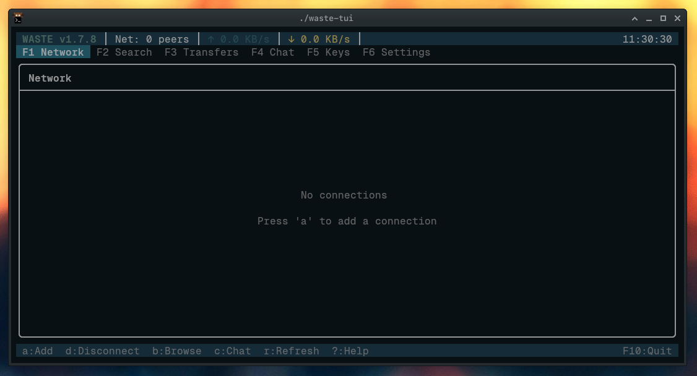
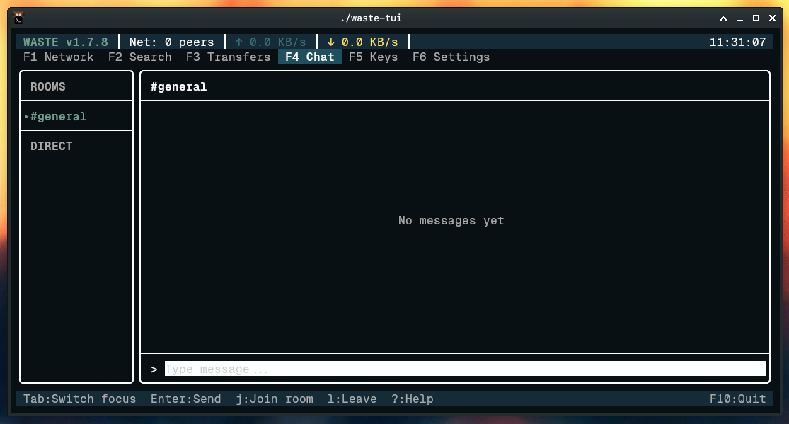
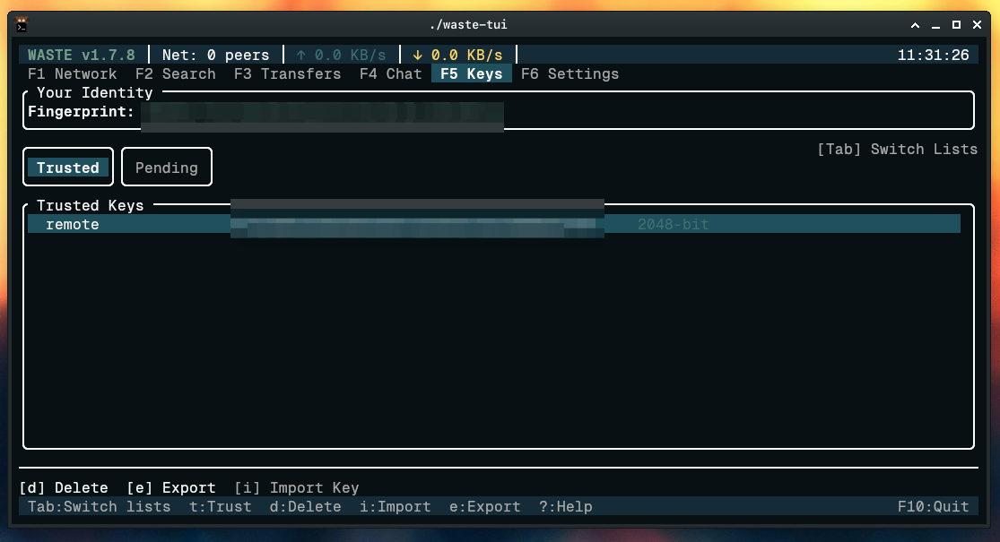
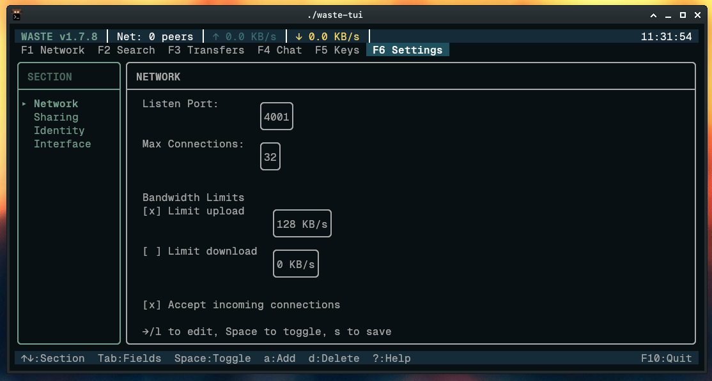

# WASTE TUI

A private, encrypted network for you and your friends. Share files, chat, and stay connected - without any central servers or cloud services.



## What is WASTE?

WASTE was created by Justin Frankel (of Winamp/WinRAR fame) at Nullsoft in 2003. It's a peer-to-peer network where only people you trust can connect - like a private VPN for file sharing and chat.

This project brings WASTE back with a modern Linux terminal interface.

## Features

- **Private Network** - Only connect with people you explicitly trust
- **End-to-End Encryption** - All traffic encrypted between peers
- **Group Chat** - Chat rooms shared across your network
- **File Sharing** - Search and download files from connected peers
- **File Transfers** - Upload and download with progress tracking
- **No Central Server** - Fully decentralized, runs on your machines

## Screenshots

| Network | Chat |
|---------|------|
|  |  |

| Key Manager | Settings |
|-------------|----------|
|  |  |

## Build

Requires CMake 3.14+ and a C++17 compiler.

```bash
cd tui/build
cmake ..
make -j$(nproc)
./waste-tui
```

## Getting Started

WASTE uses encryption keys for security. Before you can connect with a friend:

1. **First run** - Launch `./waste-tui` and generate your keys
2. **Export your key** - Press `F5` (Keys), then `e` to export your public key
3. **Exchange keys** - Send your `.wastekey` file to your friend (email, Signal, etc.)
4. **Import their key** - Press `i` to import, then `t` to trust their key
5. **Connect** - Press `F1` (Network), then `a` to add their IP address

Both users need each other's keys before connecting. Default port is **4001**.

## Keybindings

| Key | Action |
|-----|--------|
| `F1`-`F6` | Switch views (Network, Search, Transfers, Chat, Keys, Settings) |
| `↑`/`↓` or `j`/`k` | Navigate |
| `Enter` | Select |
| `a` | Add item |
| `d` | Delete item |
| `Esc` | Back/Cancel |
| `F10` | Quit |

## Current Status

**Version 1.8.1** - Working: peer connections, chat, file transfers, key management, search. See [known limitations](DEVELOPMENT.md#known-limitations).

## More Info

- [DEVELOPMENT.md](DEVELOPMENT.md) - Technical documentation, architecture, and security notes
- [LICENSE](LICENSE) - GPL v2

---

*Originally created by Nullsoft (2003). TUI client and Linux port by contributors (2024-2026).*
